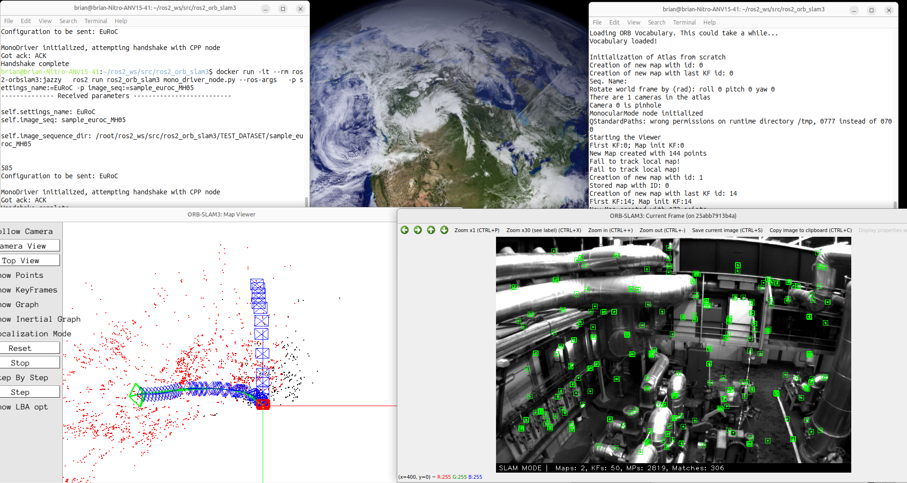

# ROS2 ORB-SLAM3 Docker Image

A Docker container setup for running ROS2 ORB-SLAM3 with ROS 2 Jazzy (Ubuntu 24.04). This package provides a ROS2 wrapper for ORB-SLAM3 V1.0 with focus on native integration with ROS2 ecosystem.

## Overview

This repository contains a Dockerfile that creates a fully configured environment for ROS2 ORB-SLAM3, including:
- ROS 2 Jazzy Desktop Full installation
- All required system dependencies for ORB-SLAM3
- Pangolin visualization library (built from source)
- Pre-built ROS2 ORB-SLAM3 workspace
- OpenCV compatibility fixes

The package builds [ORB-SLAM3](https://github.com/UZ-SLAMLab/ORB_SLAM3) V1.0 as a shared internal library and comes included with third-party libraries (DBoW2, g2o, Sophus). This is the `jazzy` branch which supports ROS 2 Jazzy. Switch to the `humble` branch for ROS 2 Humble support.

## Quick Start with Docker (Recommended)

### Building the Docker Image

To build the Docker image, run:

```bash
docker build -t ros2-orbslam3:jazzy .
```

The build process will:
1. Install ROS 2 Jazzy Desktop Full
2. Install system dependencies (Eigen3, OpenSSL, OpenGL libraries, etc.)
3. Build and install Pangolin from source
4. Clone the ros2_orb_slam3 repository
5. Install ROS dependencies via rosdep
6. Build the ROS2 workspace with colcon

**Note:** The build process may take 20-30 minutes depending on your system.

### Running the Demo

To verify the installation, run the demo with video + inertial data from the EuRoC dataset:

**Terminal 1** - Start the SLAM node:
```bash
docker run -it --rm \
  --env="DISPLAY" \
  --env="XDG_RUNTIME_DIR=/tmp" \
  --env="LIBGL_ALWAYS_SOFTWARE=1" \
  --env="MESA_GL_VERSION_OVERRIDE=3.0" \
  --volume="/tmp/.X11-unix:/tmp/.X11-unix:rw" \
  --ipc=host \
  --memory=4g \
  --shm-size=1g \
  ros2-orb-slam3:jazzy \
  ros2 run ros2_orb_slam3 mono_node_cpp --ros-args -p node_name_arg:=mono_slam_cpp
```

**Terminal 2** - Start the driver node:
```bash
docker run -it --rm \
  --network host \
  ros2-orb-slam3:jazzy \
  ros2 run ros2-orb-slam3 mono_driver_node.py --ros-args \
    -p settings_name:=EuRoC -p image_seq:=sample_euroc_MH05
```



Both nodes will perform a handshake and the VSLAM framework will then run. You can view the visualization in the Pangolin window.

## Docker Usage

### Basic Usage

```bash
docker run -it --rm ros2-orbslam3:jazzy
```

### With GUI Support (X11)

To enable GUI applications:

```bash
docker run -it --rm \
  --env="DISPLAY" \
  --volume="/tmp/.X11-unix:/tmp/.X11-unix:rw" \
  ros2-orbslam3:jazzy
```

On the host, allow X11 connections:
```bash
xhost +local:docker
```

### With Camera Access

To access cameras or video devices:

```bash
docker run -it --rm \
  --device=/dev/video0 \
  --privileged \
  ros2-orbslam3:jazzy
```

### With GPU Support (NVIDIA)

If you have NVIDIA Docker runtime installed:

```bash
docker run -it --rm \
  --gpus all \
  --env="DISPLAY" \
  --volume="/tmp/.X11-unix:/tmp/.X11-unix:rw" \
  ros2-orbslam3:jazzy
```

### With Network Access (ROS2 Topics)

To enable ROS2 networking between containers or with host:

```bash
docker run -it --rm \
  --network host \
  ros2-orbslam3:jazzy
```

### Complete Example (GUI + Network + Camera)

```bash
docker run -it --rm \
  --name ros2-orb-slam3 \
  --env="DISPLAY" \
  --volume="/tmp/.X11-unix:/tmp/.X11-unix:rw" \
  --network host \
  --device=/dev/video0 \
  ros2-orbslam3:jazzy
```

## Workspace Location

The ROS2 workspace is located at `/root/ros2_ws` inside the container. The ros2_orb_slam3 package is at `/root/ros2_ws/src/ros2_orb_slam3`.

To rebuild the workspace after modifications:

```bash
cd /root/ros2_ws
source /opt/ros/jazzy/setup.bash
colcon build --symlink-install
source install/setup.bash
```

## Included Components

- **ROS 2 Jazzy**: Full desktop installation
- **Pangolin**: Built from source and installed to `/usr/local/lib`
- **OpenCV**: System OpenCV with compatibility symlink (4.5d for g2o compatibility)
- **Dependencies**: All necessary libraries for ORB-SLAM3 including:
  - Eigen3
  - OpenSSL
  - OpenGL/Mesa libraries
  - FFmpeg libraries
  - Image processing libraries (JPEG, PNG, TIFF)
  - ROS cv-bridge

## Environment Variables

The container sets up:
- `ROS_DISTRO=jazzy`
- `WORKSPACE=/root/ros2_ws`
- `LD_LIBRARY_PATH=/usr/local/lib:$LD_LIBRARY_PATH`

The entrypoint automatically sources:
- `/opt/ros/jazzy/setup.bash`
- `/root/ros2_ws/install/setup.bash`

## Package Details

This ROS2 package differs from other ROS1 wrappers and ROS2 wrappers in GitHub by supporting/adopting the following:
- A separate Python node to send data to the ORB-SLAM3 C++ node (design choice)
- At least C++17 and CMake>=3.8
- Eigen 3.3.0, OpenCV 4.2+, latest release of Pangolin
- Comes with a small test image sequence from EuRoC MAV dataset (MH05) to quickly test installation
- Serves as an example of building a shared C++ library and a package with both C++ and Python nodes

## Notes

- The OpenCV compatibility symlink addresses an issue where g2o expects OpenCV 4.5d, but Ubuntu 24.04 provides OpenCV 4.6+.
- The workspace is pre-built in the image. If you need to modify the source code, you may want to mount it as a volume or rebuild the workspace.
- For persistent changes, consider mounting the workspace directory as a volume.
- g2o used is an older version and is incompatible with the latest release found at [g2o github page](https://github.com/RainerKuemmerle/g2o).
- May not build or work correctly in **resource constrained hardware** such as Raspberry Pi 4, Jetson Nano.

## Troubleshooting

### X11 Permission Denied
```bash
xhost +local:docker
```

### Cannot find shared libraries
Ensure `LD_LIBRARY_PATH` includes `/usr/local/lib` (set automatically in the container).

### ROS topics not visible
Use `--network host` flag when running the container, or ensure ROS_DOMAIN_ID matches.

### Display Issues
If you encounter display issues, try using software rendering:
```bash
docker run -it --rm \
  --env="DISPLAY" \
  --env="LIBGL_ALWAYS_SOFTWARE=1" \
  --env="MESA_GL_VERSION_OVERRIDE=3.0" \
  --volume="/tmp/.X11-unix:/tmp/.X11-unix:rw" \
  ros2-orbslam3:jazzy
```

## Manual Installation (Alternative to Docker)

If you prefer to install without Docker, see the [original repository](https://github.com/Mechazo11/ros2_orb_slam3) for detailed manual installation instructions for ROS 2 Humble or Jazzy.

## Testing Platforms

Tested on:
1. Intel i5-9300H, x86_64 bit architecture, Ubuntu 22.04 LTS (Jammy Jellyfish) and ROS2 Humble Hawksbill (LTS)
2. AMD Ryzen 5600X, x86_64 bit architecture, Ubuntu 22.04 LTS (Jammy Jellyfish) and ROS2 Humble Hawksbill (LTS)

## Citations

If you find this work useful, please consider citing:

### ORB-SLAM3 Paper
```bibtex
@article{ORBSLAM3_TRO,
  title={{ORB-SLAM3}: An Accurate Open-Source Library for Visual, Visual-Inertial 
           and Multi-Map {SLAM}},
  author={Campos, Carlos AND Elvira, Richard AND G\'omez, Juan J. AND Montiel, 
          Jos\'e M. M. AND Tard\'os, Juan D.},
  journal={IEEE Transactions on Robotics}, 
  volume={37},
  number={6},
  pages={1874-1890},
  year={2021}
}
```

### Short-Term Relocalization Paper
```bibtex
@INPROCEEDINGS{kamal2024solving,
  author={Kamal, Azmyin Md. and Dadson, Nenyi Kweku Nkensen and Gegg, Donovan and Barbalata, Corina},
  booktitle={2024 IEEE International Conference on Advanced Intelligent Mechatronics (AIM)}, 
  title={Solving Short-Term Relocalization Problems In Monocular Keyframe Visual SLAM Using Spatial And Semantic Data}, 
  year={2024},
  volume={},
  number={},
  pages={615-622},
  keywords={Visualization;Simultaneous localization and mapping;Accuracy;Three-dimensional displays;Semantics;Robot vision systems;Pipelines},
  doi={10.1109/AIM55361.2024.10637187}}
```

## License

Based on the work from [Mechazo11/ros2_orb_slam3](https://github.com/Mechazo11/ros2_orb_slam3). This project structure is heavily influenced by the excellent ROS1 port of ORB SLAM3 by [thien94](https://github.com/thien94/orb_slam3_ros/tree/master).

## TODO

- [ ] Stereo mode example
- [ ] RGBD mode example
- [ ] Detailed build instructions for `aarch64` based computers i.e. Orin Nano, Raspberry Pi etc.
- [ ] Launch files support
- [ ] RViz integration
